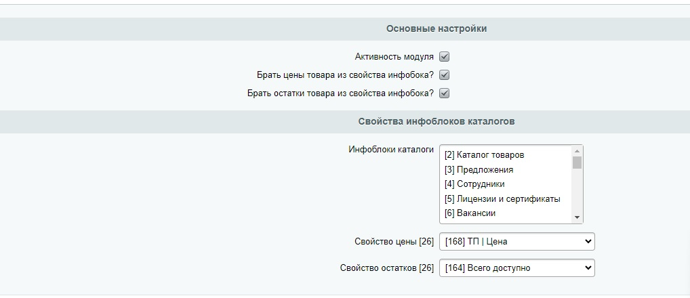

# ZR cartlite

## Описание модуля в разработке

## Ссылки

- [О проекте](#about)
- [Установка](#getting_started)
- [Использование](#usage)
- [Contributing](../CONTRIBUTING.md)

## О проекте <a name = "about"></a>

Cartlite это модуль легкой корзины для битрикса. В корзину входит обьект пользователя, корзины и заказа.

## Установка <a name = "getting_started"></a>

Чтобы установить модуль достаточно выкачать архив проекта и закинуть в папку ```bitrix/modules```. 
После этого нужно в админке сайта перейти в вкладку ```Marketplace/Установленные решения```. 
Найти там строчку ```Корзина lite (zr.cartlite)``` и нажать установить.

### Использование <a name = "usage"></a>

Чтобы работать с корзиной, нужно настроить ее. Настроки находятся по пути обычных настроек модулей.



После этого нужно настроить отправку данных о добавляемом товаре по пути ```/ajax/cartlite_action.php```. 
Что нужно отправить, можно посмотреть в выше указанном файле.